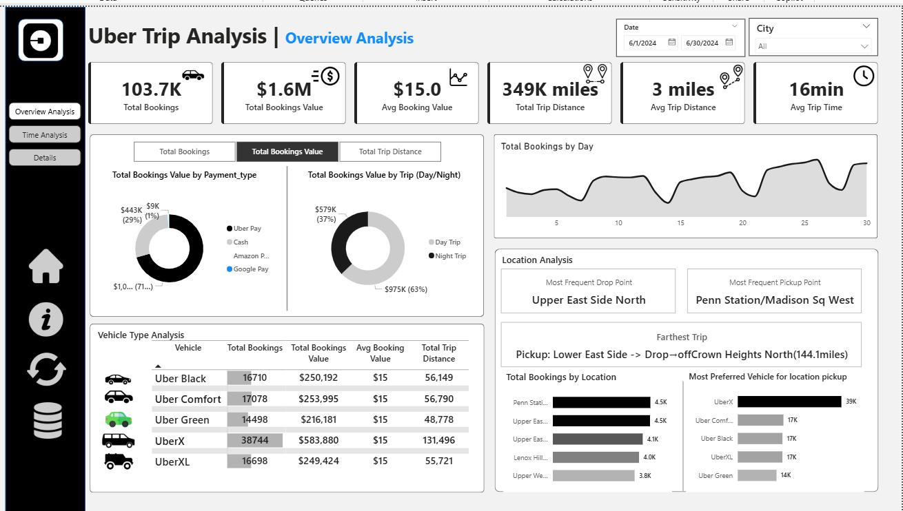
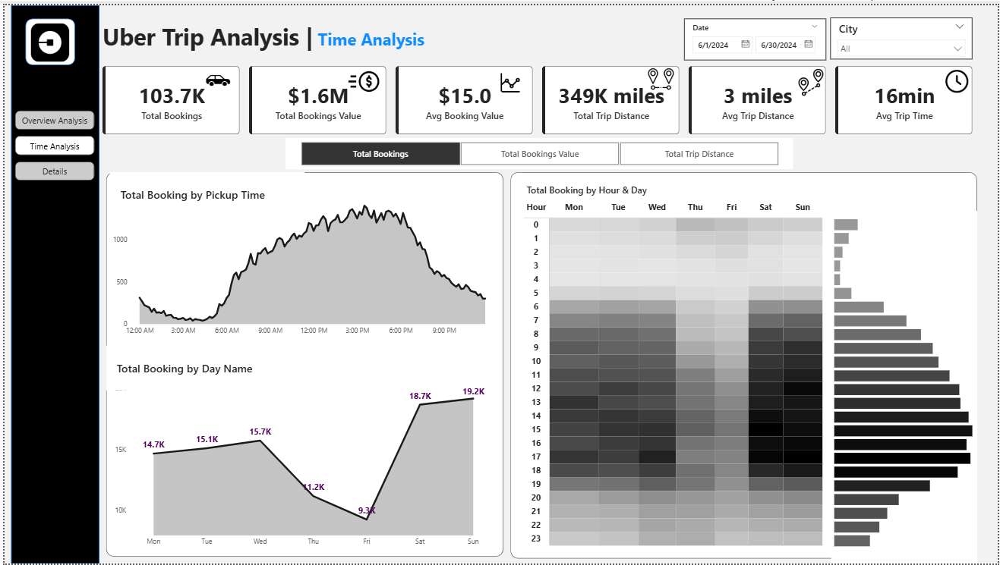
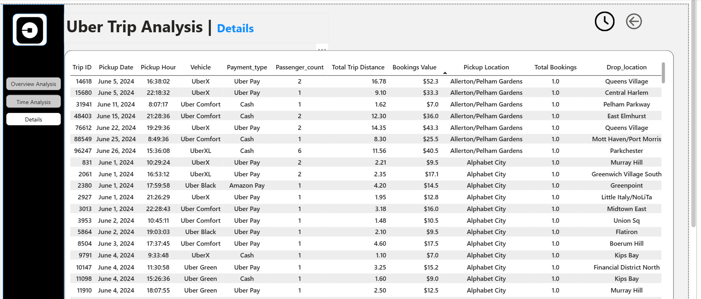
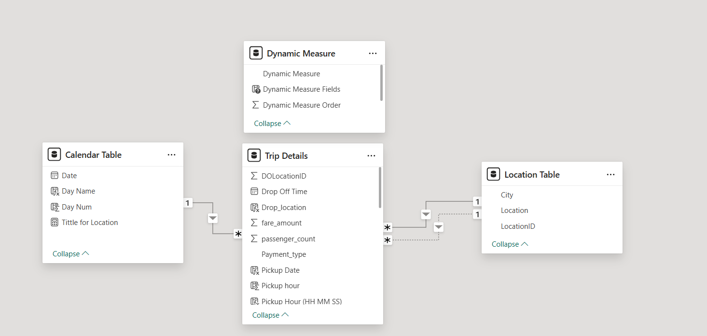

# 🚗 Uber Trip Analysis Dashboard

This Power BI project analyzes Uber trip data to gain insights into booking trends, revenue, time patterns, and trip efficiency. The dashboards are designed to help stakeholders make **data-driven decisions** for operations, customer satisfaction, and strategic planning.

---

## 📈 Dashboards Included

### 1️⃣ Overview Analysis
Tracks key KPIs such as total bookings, revenue, average distance, and booking value.

---

### 2️⃣ Time Analysis
Visualizes booking trends by time of day, day of week, and 10-minute intervals to highlight peak demand hours.

---

### 3️⃣ Detail Tab
Interactive table with drill-through functionality to explore trip-level data and identify granular patterns.

---

### 4️⃣ Data Model View  
Star schema with a central fact table linked to date, city, vehicle, and payment dimensions for efficient data slicing.

---

## 📊 Key Features

- 🧮 **Dynamic KPI Selector** – Switch between Total Bookings, Revenue, and Trip Distance.
- 🎯 **Slicers & Filters** – By Date, City, Payment Type, Vehicle Type, and Trip Type.
- 💬 **Tooltips** – Show contextual metrics like Avg Booking Value & Trip Duration.
- 🛠️ **Bookmarks** – Quick navigation for data dictionary & full data view.
- 🔄 **Reset Button** – One-click reset of all filters.
- 📤 **Export Button** – Download raw data via Power BI / Power Automate.

---

## 🎯 Business Outcomes

- 📌 Identify trends in ride bookings and revenue
- 📌 Improve trip efficiency by analyzing trip time and distance
- 📌 Understand customer behavior by location and preferred vehicle type
- 📌 Optimize driver allocation and dynamic pricing strategies

---

## 💻 Tools & Technologies

- **Power BI**
- **DAX** (for dynamic measures & KPI logic)
- **Bookmarks & Actions**
- **Power Query (M)**
- **Power Automate** (for export functionality)

---

